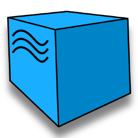
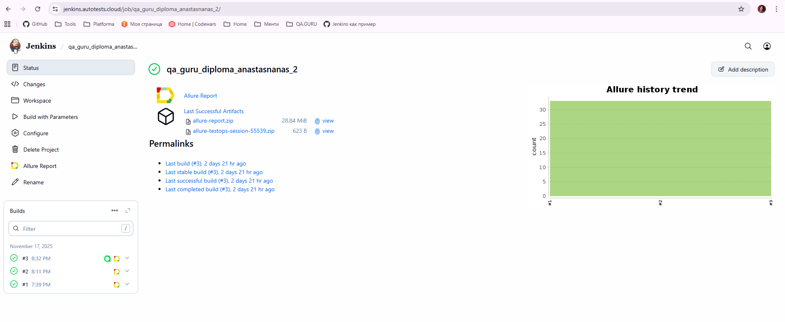
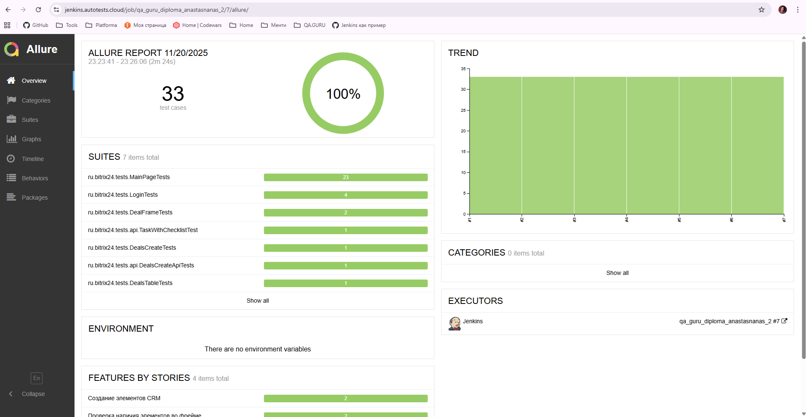
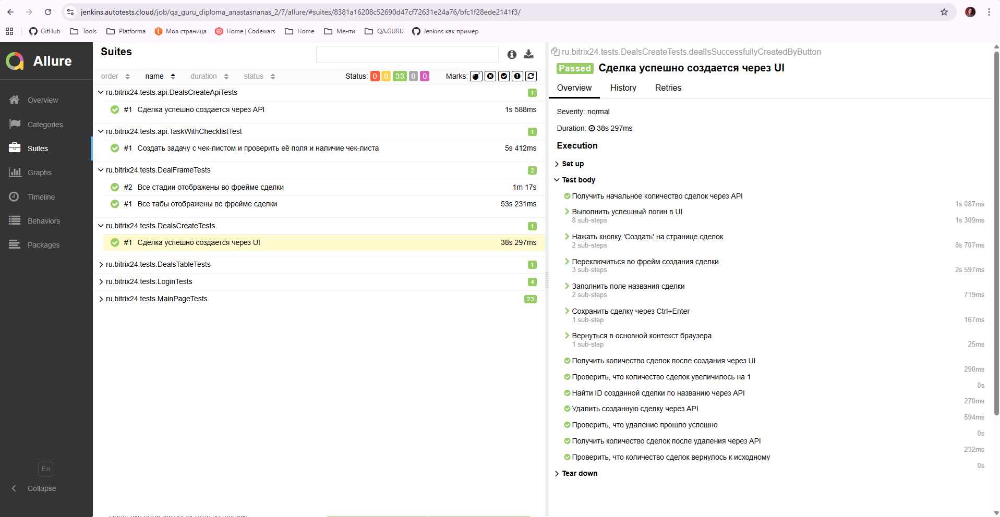
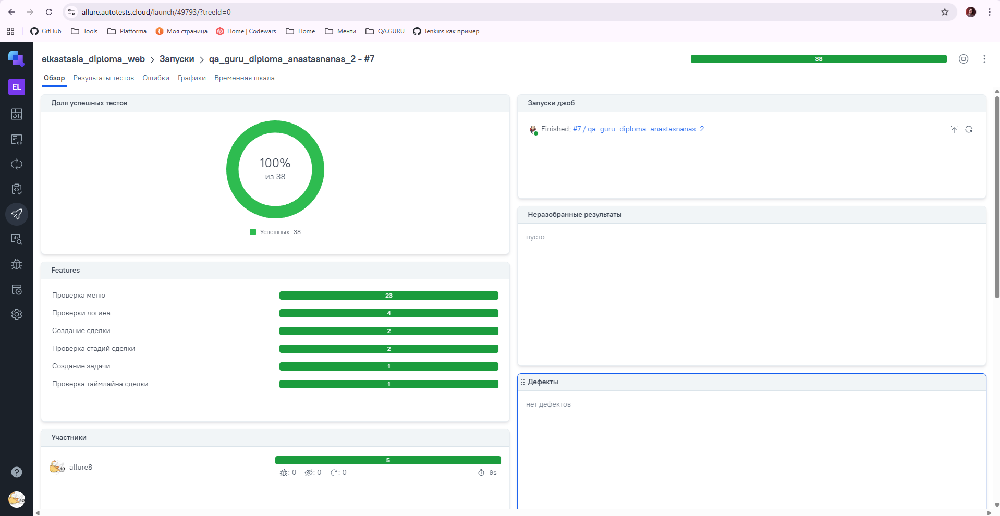
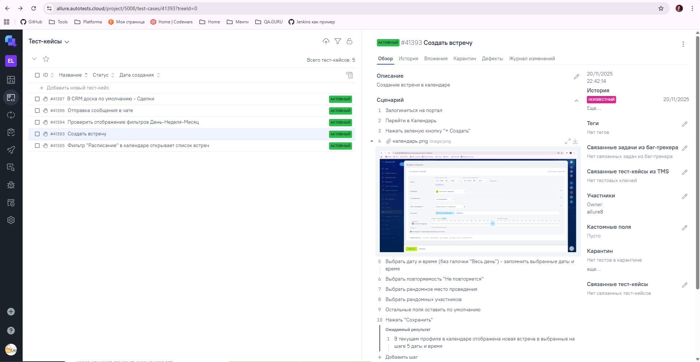

# Дипломная работа по автоматизации тестирования портала Битрикс.24

 

 

  <strong>💡 Что такое Битрикс.24?</strong> 
  Битрикс24 — это комплексная облачная платформа, объединяющая в одном рабочем пространстве CRM, задачи, документы, чаты, звонки, видеоконференции и автоматизацию бизнес-процессов.

 

<strong> 🌿 Почему Битрикс.24 был выбран для дипломного проекта? </strong> 
На своей практике я видела, что не все компании используют CRM в таком виде, в котором его продает вендор. И конечно, любая доработка может сломать что-либо, снижается стабильность сайта. Автотесты помогут раньше обнаруживать ошибки и снизить нагрузку на ручных тестировщиков.
  
🌿 В дипломной работе был использован пустой и бесплатный Битрикс, но проект вполне может использоваться как шаблон - часть взаимодействий проходит через API, чтобы сделать прогоны быстрее и стабильнее. Для написания таких тестов была использована официальная документация, ознакомиться на сайте вендора: https://helpdesk.bitrix24.ru/open/9721839/.

Использованы лого с сайта <a target="_blank" href="https://icons8.com/icon/13679/java">Логотип Java Coffee Cup</a> иконка от <a target="_blank" href="https://icons8.com">Icons8</a>

## Технологии и инструменты:

  

 

<table style="border-collapse: collapse; border: none; width: 100%; margin: 0; background: transparent;">
  <tr>
    <td style="border: none; padding: 8px; vertical-align: top; width: 50%; background: transparent;">
      • Автотесты написаны на языке Java 
      • Инструмент сборки Gradle 
      • Тестовые фреймворки JUnit 5 и REST-assured 
      • Удаленный запуск реализован на Jenkins 
      • Отчеты генерируются с использованием Allure report 
      • Добавлена интеграция с Allure TestOps
    </td>
    <td style="border: none; padding: 8px; vertical-align: top; width: 50%; text-align: center; background: transparent;">
      <a href="https://rest-assured.io/">
        
    </td>
  </tr>
</table>

## Примеры тест-кейсов / проверок:
✅ Проверки меню: все пункты меню отображаются 
✅ Создание элементов: сделка создается корректно через UI и API 
✅ Проверки авторизации и входа на портал 

## Сборка в Jenkins ([ссылка](https://jenkins.autotests.cloud/job/qa_guru_diploma_anastasnanas_2/))

## Allure отчет ([ссылка](https://jenkins.autotests.cloud/job/qa_guru_diploma_anastasnanas_2/7/allure/#))

🌿 При переходе по ссылке будет открыта вкладка Overview с общей статистикой по прогону. При клике на любой сьют (Suites) будут отображены кейсы с понятными названиями + справа шаги, которые были пройдены автотестом (скрин 2). 

 
 

## Allure TestOps ([ссылка](https://allure.autotests.cloud/launch/49793/?treeId=0))
 
 
